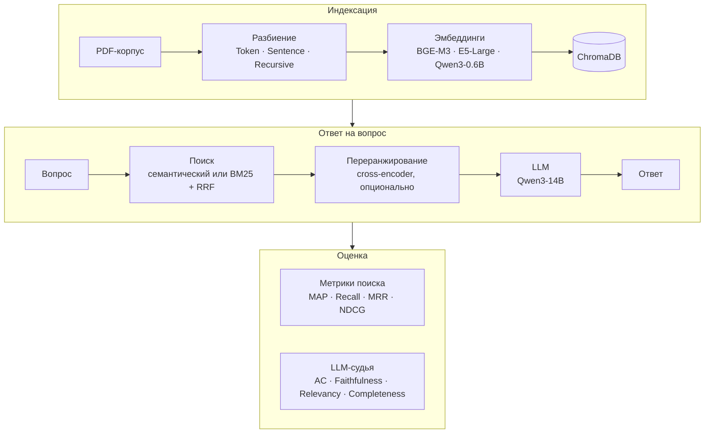

# compareRAG

Исследовательский стенд для сравнения конфигураций RAG-систем на русскоязычных корпусах. Каждый компонент конвейера (разбиение на фрагменты, модель эмбеддингов, тип поиска, переранжирование, top-k) заменяется через YAML-конфиг. Качество оценивается на двух уровнях: метриками информационного поиска и LLM-судьёй по итоговым ответам.

На стенде выполнены [ВКР](#публикации) и две научные работы, проиндексированные в РИНЦ.

## Главный вывод

**Метрики поиска не предсказывают качество ответа.** Улучшение ранжирования может не дать прироста качества ответов, а иногда сопровождается его ухудшением. Решающим оказывается объём и смысловая целостность контекста, который попадает в модель.

| Что меняли | Метрики поиска | Качество ответа (AC, шкала 1–5) |
|---|---|---|
| Переранжирование cross-encoder'ом (PostgreSQL) | NDCG@10 **+6,6 п. п.** | **+0,17** балла |
| top-k с 1 до 10 | NDCG@k на ГК РФ и PostgreSQL достигает максимума при k = 3–5, затем снижается | от +0,34 до **+1,39** балла |
| Фрагменты 256 → 1024 токена (ГК РФ, Token) | NDCG@10 0,918 → 0,828 | 4,03 → **4,57** |

Практические следствия:
- настраивать RAG только по метрикам поиска нельзя, нужна совместная оценка с LLM-судьёй;
- top-k стоит брать с запасом: не меньше 5, а для доменов, где ответ собирается из нескольких мест, 10;
- мелкие фрагменты (256 токенов и меньше) с рекурсивным разбиением рвут смысловые единицы;
- переранжирование в эксперименте замедляло прогон в 6,5–15 раз; включать его стоит по приросту качества ответов, а не NDCG.

## Результаты

### Тип поиска и стратегия разбиения

NDCG@10, усреднённый по остальным параметрам конфигурации; лучший вариант в каждом домене выделен:

| Домен | Sentence | Token | Recursive | Гибридный | Семантический |
|---|---|---|---|---|---|
| Гражданский кодекс РФ | **0,895** | 0,885 | 0,875 | **0,890** | 0,881 |
| Медицинские статьи | **0,758** | 0,700 | 0,730 | 0,719 | **0,740** |
| Документация PostgreSQL | 0,732 | **0,764** | 0,719 | **0,766** | 0,710 |

- Стратегия разбиения — один из главных факторов: разброс NDCG@10 от 2 до 6 п. п. Token выигрывает на PostgreSQL, потому что код и SQL плохо делятся на предложения.
- Гибридный поиск (BM25 + векторный через RRF) даёт +5,6 п. п. на технической документации, где важны точные термины. На медицине лучше чисто семантический (+2,1 п. п.) из-за синонимии терминов.
- Модель эмбеддингов влияет меньше всего: разброс не больше 2,8 п. п. Компактная Qwen3-Embedding-0.6B сопоставима с BGE-M3 и E5-Large.

### Размер фрагмента

27 конфигураций: 3 домена × 3 стратегии разбиения × 256 / 512 / 1024 токена; BGE-M3, гибридный поиск, k = 10. Крупные фрагменты (1024) почти везде дают наибольшую правильность ответа (AC), даже когда их NDCG@10 ниже, чем у мелких: мелкие фрагменты ранжируются точнее, но беднее по содержанию.

| Домен | Стратегия | NDCG@10: 256 / 512 / 1024 | AC: 256 / 512 / 1024 |
|---|---|---|---|
| Гражданский кодекс РФ | Token | 0,918 / 0,881 / 0,828 | 4,03 / 4,57 / 4,57 |
| | Sentence | 0,901 / 0,914 / 0,879 | 4,57 / 4,60 / 4,67 |
| | Recursive | 0,875 / 0,883 / 0,852 | 3,67 / 4,47 / 4,69 |
| Медицинские статьи | Token | 0,643 / 0,674 / 0,748 | 3,77 / 4,53 / 4,73 |
| | Sentence | 0,704 / 0,764 / 0,755 | 4,33 / 4,33 / 4,87 |
| | Recursive | 0,765 / 0,722 / 0,705 | 3,27 / 4,57 / 4,62 |
| Документация PostgreSQL | Token | 0,715 / 0,789 / 0,729 | 4,53 / 4,67 / 4,66 |
| | Sentence | 0,798 / 0,779 / 0,768 | 4,45 / 4,55 / 4,73 |
| | Recursive | 0,693 / 0,766 / 0,746 | 4,21 / 4,27 / 4,80 |

### Число извлекаемых фрагментов (top-k)

| Домен | k | NDCG@k | Recall@k | AC | Полнота |
|---|---|---|---|---|---|
| Гражданский кодекс РФ | 1 | 0,967 | 0,744 | 4,23 | 3,83 |
| | 3 | **0,970** | 0,844 | 4,53 | 4,27 |
| | 5 | 0,948 | 0,889 | **4,60** | 4,40 |
| | 10 | 0,914 | 0,922 | 4,57 | **4,47** |
| Медицинские статьи | 1 | 0,733 | 0,617 | 3,73 | 3,60 |
| | 3 | 0,813 | 0,817 | 4,37 | 4,27 |
| | 5 | 0,814 | 0,867 | 4,40 | 4,27 |
| | 10 | **0,817** | 0,983 | **4,73** | **4,67** |
| Документация PostgreSQL | 1 | 0,533 | 0,394 | 3,21 | 2,79 |
| | 3 | 0,802 | 0,689 | 4,31 | 3,97 |
| | 5 | **0,817** | 0,761 | 4,47 | 4,27 |
| | 10 | 0,796 | 0,856 | **4,60** | **4,47** |

Фрагменты по 512 токенов. ГК РФ — гибридный поиск, разбиение по предложениям, BGE-M3; медицина — семантический поиск, разбиение по предложениям, BGE-M3; PostgreSQL — гибридный поиск, разбиение по токенам, E5-Large.

Recall@k растёт монотонно, а NDCG@k на ГК РФ и PostgreSQL немонотонен: по нему оптимальным выглядит k = 3–5. Правильность ответа растёт с k во всех доменах (на ГК РФ максимум уже при k = 5), а полнота ответа на PostgreSQL увеличивается в 1,6 раза. При k = 1 нерелевантный единственный фрагмент даёт каскадную ошибку: AC = 1 при достоверности 5.

### Переранжирование (PostgreSQL, 20 кандидатов → top-10)

| Конфигурация | MAP@10 | NDCG@10 | AC | Полнота |
|---|---|---|---|---|
| Без переранжирования | 0,668 | 0,796 | 4,60 | 4,47 |
| BGE-reranker-v2-m3 | 0,714 | 0,838 | 4,73 | 4,63 |
| Jina-reranker-v2-base-multilingual | **0,751** | **0,862** | **4,77** | **4,63** |

Прирост MAP@10 — 8,3 п. п., NDCG@10 — 6,6 п. п., а правильности ответа — лишь 0,17 балла. На Гражданском кодексе, где базовый MRR уже 0,967, эффект переранжирования на качество ответов нулевой или отрицательный. Модель устойчива к порядку фрагментов: если нужная информация есть хотя бы в одном из них, ответ получается качественным независимо от позиции.

### Типичная ошибка, которую не видят метрики поиска

Медицинский корпус, рекурсивное разбиение на 256 токенов: NDCG@10 высокий (0,765), а средняя правильность ответа минимальная во всём эксперименте (3,27). На вопрос о доле пациентов, продолживших принимать препараты через полгода после обучения, поиск отработал идеально: все метрики поиска равны 1,000. Но ответ получил AC = 1 при достоверности 5. Разбиение разорвало смысловую единицу: в найденный фрагмент попало упоминание исследования, а само число осталось в соседнем. Модель честно ответила по контексту, но ответа в контексте не было.

## Как устроено



- **Модульность:** каждый компонент реализует базовый интерфейс (`src/core/base_*.py`) и создаётся фабрикой по имени из конфига. Новая стратегия добавляется одним классом и строкой в реестре.
- **Гибридный поиск:** BM25 с морфологической нормализацией (pymorphy3) и векторный поиск, слияние методом Reciprocal Rank Fusion (k = 60).
- **Переранжирование:** cross-encoder'ы BGE-reranker-v2-m3 и Jina-reranker-v2, а также Qwen3-Reranker-0.6B (оценка релевантности через yes/no-логиты).
- **Модели:** любой OpenAI-совместимый API. Эмбеддинги можно считать локально в LM Studio, а генерацию отправлять в удалённый API.
- **Оценка:** 4 метрики поиска по эталонной разметке релевантных страниц и 4 критерия LLM-судьи по шкале 1–5.
- **Эксперименты:** батч-раннеры с dry-run и возобновлением после сбоя, сбор результатов в сводные таблицы.

## Методика

| Корпус | Объём | Вопросы |
|---|---|---|
| Гражданский кодекс РФ | 663 стр. | 30 |
| Статьи Российского медицинского журнала | 117 статей | 30 |
| Документация PostgreSQL (рус.) | 530 стр. | 30 |

Вопросы и эталонные ответы сгенерированы LLM (Qwen3-235B, Claude Sonnet 4.6), затем вручную проверены и исправлены; релевантные страницы размечены вручную. Метрики поиска: MAP@k, Recall@k, MRR, NDCG@k. Метрики ответа выставляет LLM-судья (LLM-as-a-Judge), получая вопрос, эталон, ответ и контекст: правильность (AC), достоверность, релевантность и полнота.

**Ограничения.** Генерация и оценка выполнены одной моделью (Qwen3-14B), поэтому возможно завышение оценок собственных ответов (self-enhancement bias). Модель, процедура и промпт судьи одинаковы во всех конфигурациях, меняются только параметры поиска, так что смещение не меняет порядок различий между конфигурациями — а предмет исследования именно они. 30 вопросов на домен — небольшая выборка, абсолютные значения стоит воспринимать как ориентир.

## Быстрый старт

Нужны Python 3.10+ и OpenAI-совместимый сервер моделей, например [LM Studio](https://lmstudio.ai/) на `http://127.0.0.1:1234` с моделью эмбеддингов (`bge-m3`) и LLM (`qwen3-14b`).

```bash
git clone https://github.com/Rumpel0726/compareRAG && cd compareRAG
python -m venv venv && source venv/bin/activate   # Windows: venv\Scripts\activate
pip install -r requirements.txt

# Корпуса не входят в репозиторий: положите PDF в data/Civil_Code, data/Medical_articles, data/PostrgreSQL

# 1. Индексация
python scripts/ingest_documents.py --config configs/strategies/postgresql/baseline.yaml \
    --data-dir data/PostrgreSQL --embedding-model text-embedding-bge-m3 --reset

# 2. Оценка одной конфигурации
python scripts/run_evaluation.py --config configs/strategies/postgresql/baseline.yaml \
    --domain postgresql --embedding-model text-embedding-bge-m3 --top-k 10

# 3. Веб-чат по проиндексированному корпусу
cd web && python app.py   # http://localhost:8000
```

Генерацию можно отправить в удалённый API, оставив эмбеддинги локальными: флаги `--llm-url`, `--llm-model`, `--api-key`.

## Воспроизведение экспериментов

| Эксперимент | Скрипт | Конфигураций |
|---|---|---|
| Разбиение × эмбеддинги × тип поиска | `scripts/run_batch.py` | 54 |
| Размер фрагмента (256 / 512 / 1024) | `scripts/run_chunksize_test.py` | 27 |
| top-k (1 / 3 / 5 / 10) | `scripts/run_topk_test.py` | 12 |
| Переранжирование | `scripts/run_rerank_test.py` | 9 |
| Сводные таблицы | `scripts/collect_results.py` | — |

У всех раннеров есть `--dry-run`, фильтры `--only-domain` и подобные, а прогресс сохраняется для возобновления после сбоя. Полный список команд и аргументов — в [COMMANDS.md](COMMANDS.md).

Полные логи всех прогонов (метрики по каждому вопросу, ответы, оценки судьи) лежат в [`experiments/`](experiments) в структуре `домен/тип поиска/модель/разбиение/размер`. Сводные таблицы по экспериментам — в [`size/`](size), [`topk/`](topk) и [`reranking/`](reranking).

## Структура проекта

```
src/
├── core/                 базовые интерфейсы и конфигурация (Pydantic)
├── document_processing/  загрузка PDF, очистка, привязка к страницам
├── chunking/             Token (Chonkie), Sentence, Recursive, Semantic, LangChain
├── embeddings/           клиент OpenAI-совместимых эмбеддингов
├── vector_stores/        ChromaDB
├── retrieval/            семантический, BM25, гибридный (RRF), reranker
├── llm/                  клиент LLM и промпты
├── agents/               оркестратор и агент синтеза ответа
└── evaluation/           вопросы, эталоны, метрики поиска, LLM-судья
configs/strategies/       YAML-конфиги по доменам
scripts/                  индексация, оценка, раннеры экспериментов, генерация вопросов
web/                      чат на FastAPI
```

## Публикации

1. Калинин И. А. [Сравнительный анализ конфигураций RAG-систем для интеллектуального поиска информации в текстовых корпусах различных предметных областей](https://elibrary.ru/item.asp?id=91599170) // Путь в науку: прикладная математика, информатика и информационные технологии. Ярославль: ЯрГУ, 2026. С. 14–17.
2. Калинин И. А., Лагутина Н. С. О несоответствии метрик качества поиска и качества генерации при оценке RAG-систем // Заметки по информатике и математике. Вып. 18. ЯрГУ, 2026 (в печати).

## Стек

Python · LangChain · ChromaDB · Chonkie · rank-bm25 · pymorphy3 · sentence-transformers · FastAPI · Pydantic · Loguru · LM Studio

## Автор

Илья Калинин · [GitHub](https://github.com/Rumpel0726) · i_kalinin_04@mail.ru
